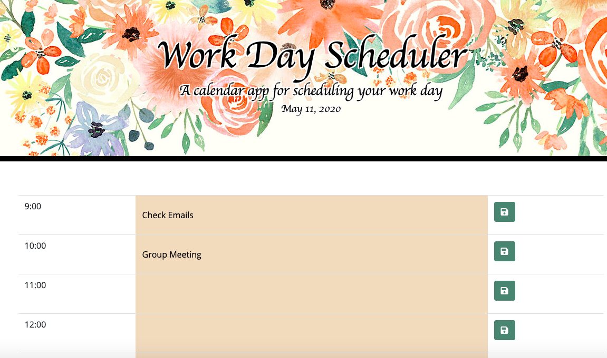

# Work Day Scheduler

## Description
A work day calendar for adding, deleting, and editing events.

## Table of Contents

* [License](#license)
* [Pitch](#pitch)
* [Contributing](#contributing)
* [Links](#Links)
* [Tenchnologies](#Technologies)
* [Developer](#Developer)

## License
MIT

## Contributing
No contributors allowed.

## Links
* GitHub repository URL: https://github.com/annaxgrace/WorkDayScheduler
* GitHub Pages deployed URL: https://annaxgrace.github.io/WorkDayScheduler/

## Technologies

### Languages 
* HTML, CSS, JavaScript

### FrameWorks
* Bootstrap, Express

### Libraries
* Moment.js

## Developer

### Anna Conover

* Github username: annaxgrace
* Email: anna.grace.conover@gmail.com
* Deployed Project URL: annaxgrace.github.io/Portfolio

